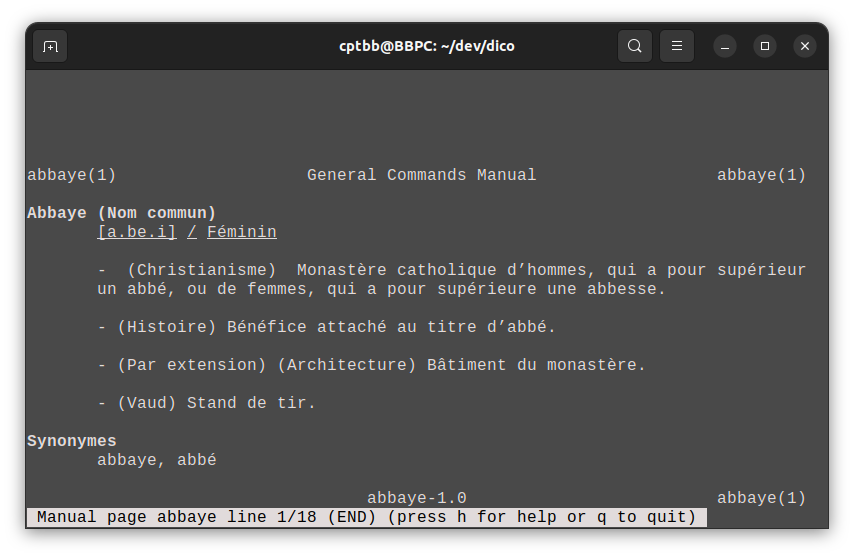

# DICO

Dico est un dictionnaire francais local,
un script de scrapping est a disposition pour recuperer tout les mots est le definition et formatte le fichier comme il faut.

# scrapping

pour recuperer les definition :

```bash
sudo chmod +x ./scrap.sh
sudo ./scrap.sh
```
/!\ Attention : ce script scrap les 346 200 mots récuperer dans le fichier ```/usr/share/dict/french```,
donc il va prendre énormement de temps pour tout scrappé, prévoyez plusieurs heures devant vous. 

# installation

```bash
sudo chmod +x ./dico.sh
sudo cp ./dico.sh /usr/local/bin/dico
```

# utilisation

pour voir la définition d'un mot faite :

```bash
dico <mot>
```

exemple :

```bash
dico abbaye
```


